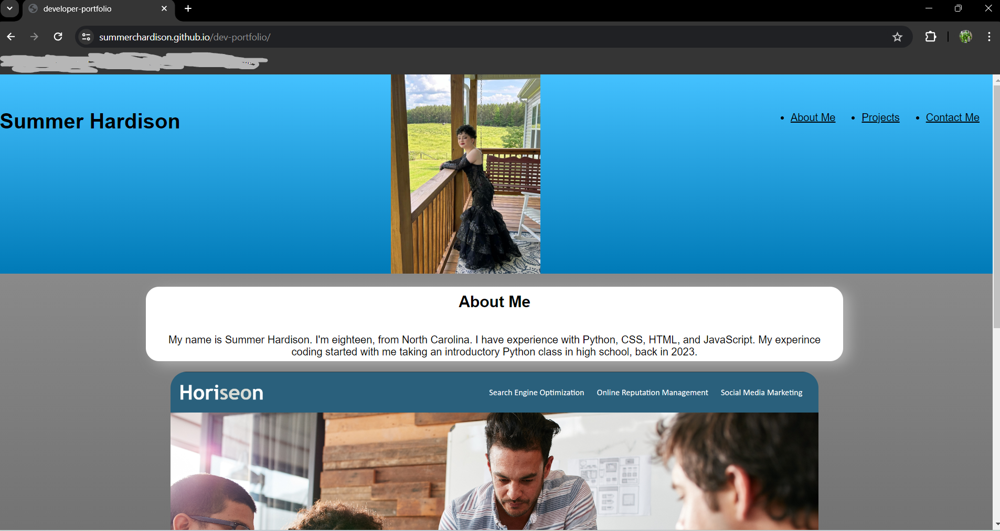

# dev-portfolio

## Description

This web application is a portfolio that links to my deployed web applications that are currently up, so potential employers can see the quality of work I produce. It was created as a way to build my resume, and showcase my projects. As well as help me learn how to formate wep pages using CSS and HTML.

## To application

[https://summerchardison.github.io/dev-portfolio/](https://summerchardison.github.io/dev-portfolio/)

## Credits
Summer Hardison

Thank you to the staff and my classmates at UNC-charlotte for giving me pointers and ideas of how to format my code and build this web application.